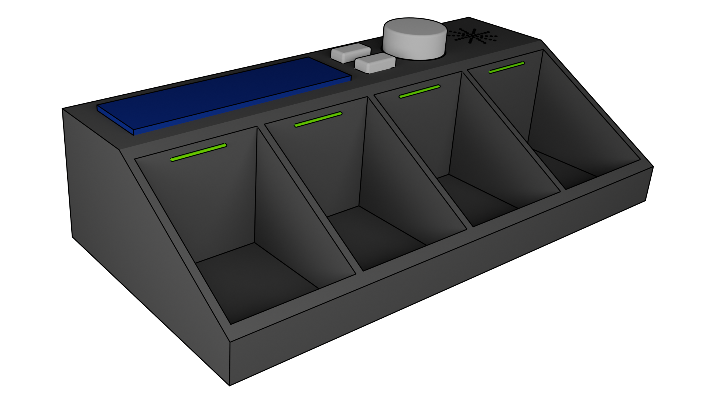
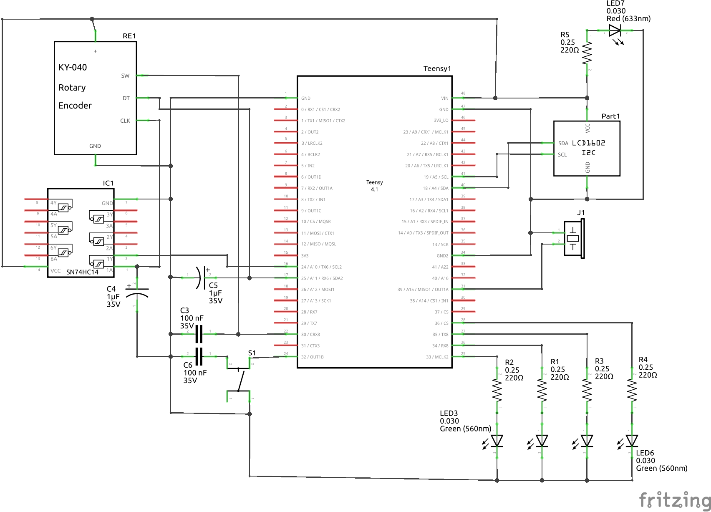
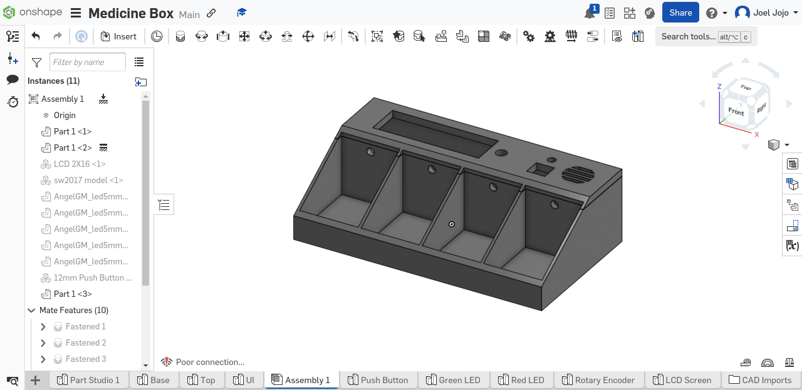
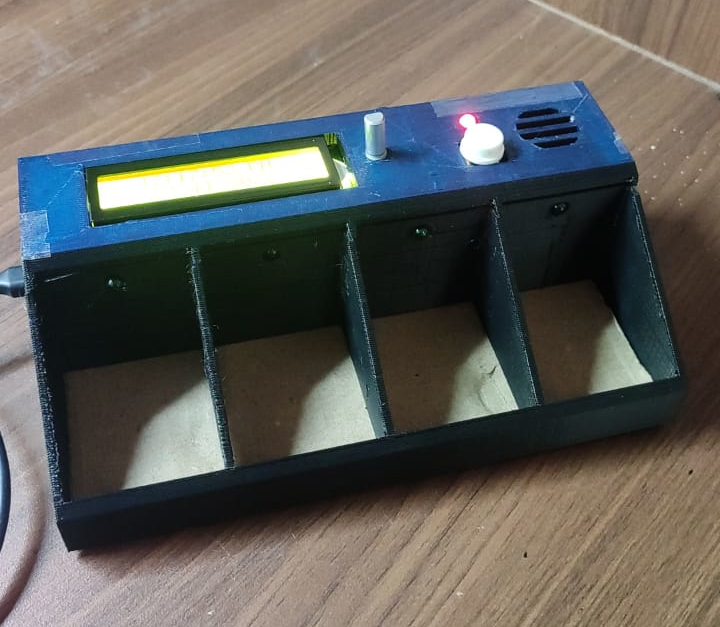

# Smart-Medication-Box

## Introduction

A considerable percentage of the elderly population takes medicines regularly. Sometimes, they forget to take their medication, which may lead to severe repercussions. This project aims to enhance medication adherence by developing a medicine box with personalized reminders for users to take their medications at user-defined times.



## Technologies Used


## Implementation

- The whole project is based on Teensy 4.1 microcontroller.
- Users can set, modify or remove reminders using the rotary encoders and push button on the box.
- The box can give visual and auditory alerts using the LEDs on each rack and the buzzer.
- The inbuilt RTC of the microcontroller helps in keeping track of time.
- The user data and preferences are stored on an SD card attached to the Teensy.
- A 3D printed case is created to house all the electronics.

## Schematics

The circuit has been made on Fritzing. [Here](/Circuit_Diagram.fzz) is the Fritzing file.



> **Note:**
> - We have wired the clk of the rotary encoder to a 7414 Hex Schmitt Trigger IC because the signals from the encoders were noisy. This is not necessary and the clk of the encoder can be wired directly to the teensy if the rotary encoder works fine.
> - Other than these connections, make sure to hook up a coin cell Li-Ion battery to the VBat pin right behind the SD card slot. This battery will be used to power the RTC even when the Teensy is switched off.

## Design of the Medication Box

The medication box was designed in OnShape. The ```.stl``` files can be taken from [here](/Models). To edit the model, [here](https://cad.onshape.com/documents/3bb37c6f5c3fc5625ebe736c/w/5e6eef892a42bb9e06b4f36b/e/434df4fac0757aec08d6021b) is the link to the OnShape document.



## Everything Put Together

After testing the circuits, rigging the circuit on a perfboard and placing all the components inside the 3D print, this is how it looks at the end.



## Future Scope

- Improving portability by using rechargeable batteries.
- Integrating the medication box with mobile applications.
- Enable IoT connectivity toprovide remote monitoring features for healthcare providers.
- Implement machine learning to provide personalized insights and predictions to optimize medication adherence.
- Extend the capabilities of the medication box to accommodate a broader range of medication types.

## Project Members

1. [Joel Jojo Painuthara](https://github.com/JoelJojoP)
2. [Jalak Jignesh Kamdar](https://github.com/jalakjk13)

## License

This repository is licensed under the [MIT License](https://github.com/JoelJojoP/Smart-Medication-Box/blob/main/LICENSE)
